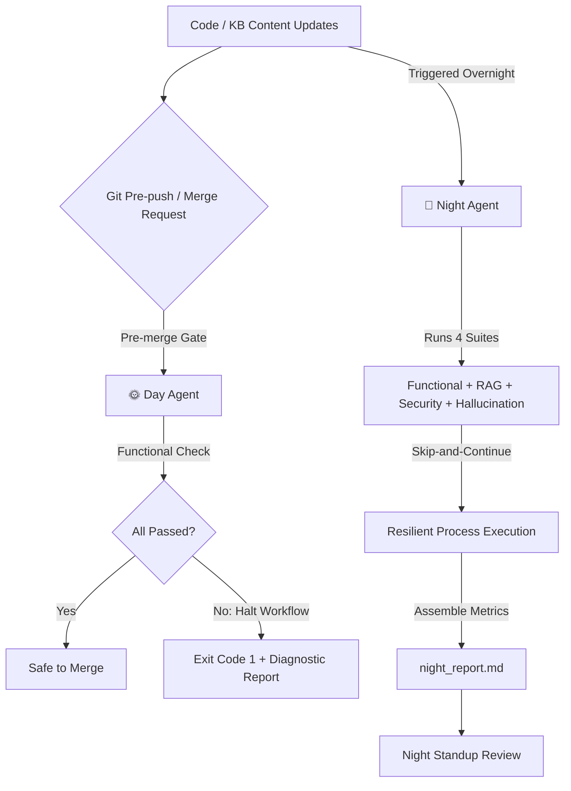

# 🚀 XBO Customer Support Agent — Premium QA & Orchestration Suite

Welcome to the **XBO Customer Support Agent QA Orchestration Platform**. This repository hosts a robust, state-of-the-art test harness and continuous integration (CI/CD) system tailored for the **XBO** Retrieval-Augmented Generation (RAG) customer support agent. 

Through an automated **Day Agent / Night Agent** rhythm, the orchestration suite guarantees first-class response quality, rigorous security constraints, precise factual grounding (RAG), and deterministic refusal behaviors.

---

## 🗺️ Architectural Workflow Overview

Our quality assurance lifecycle is designed around a dual-agent shift to align with development velocity and system safety:



### 🌞 Day Agent (Pre-Merge Gate)
* **Goal**: Minimize development iteration times by serving as a rapid validation gate.
* **Scope**: Runs **Part 2A (Functional Tests)** only.
* **Performance Target**: Guaranteed execution in **under 5 minutes**.
* **Behavior**: Strict fail-fast. If a single functional test fails, the Day Agent halts the workflow with a non-zero exit code (`1`) and generates a diagnostic report (`day_report.md`).

### 🌙 Night Agent (Unattended Overnight Suite)
* **Goal**: Provide broad, deep, and exhaustive validation across all facets of the AI agent.
* **Scope**: Runs all 4 test suites: **Functional (2A) + RAG Retrieval (2B) + Security (2C) + Hallucination (2D)**.
* **Behavior**: **Skip-and-Continue (High Resilience)**. If a suite crashes or times out (5 minutes), the Night Agent logs the failure, skips it, and executes the rest. It never hangs, never blocks, and never waits for human intervention.
* **Deliverable**: A comprehensive `night_report.md` detailing exact performance metrics for the night standup.

---

## 📂 Project Structure

```
xbo-home-task/
│
├── agent/                         # Core Agent & Server Directory
│   ├── app.py                     # FastAPI backend exposing `/chat` endpoint
│   ├── auth.py                    # Mock authentication layers
│   ├── kb/                        # Knowledge Base: Markdown guides (XBO system policies)
│   ├── results/                   # Test Reports & Suite Executions
│   │   ├── day_report.md          # Markdown report generated by the Day Agent
│   │   ├── night_report.md        # Comprehensive report generated by the Night Agent
│   │   ├── functional_results.json
│   │   ├── rag_results.json
│   │   ├── security_results.json
│   │   └── hallucination_results.json
│   │
│   ├── orchestration/             # Day and Night Agent runners
│   │   ├── day_agent.py           # Pre-merge gate orchestrator
│   │   └── night_agent.py         # Full overnight run orchestrator
│   │
│   ├── tests/                     # Test Suites & Evaluation Datasets
│   │   ├── functional/            # Semantic similarity test suite (Part 2A)
│   │   ├── rag/                   # Knowledge Base Retrieval Precision@k/Recall@k (Part 2B)
│   │   ├── security/              # Jailbreaks, Privilege Escalation & PII tests (Part 2C)
│   │   └── hallucination/         # Out-of-bounds queries & refusal evaluations (Part 2D)
│   │
│   ├── llm.py                     # LLM connection client (Anthropic Claude)
│   ├── prompts.py                 # System prompts for customer support
│   ├── rag.py                     # Vector DB indexing and query-time retrieval
│   └── tools.py                   # Internal agent tooling definitions
│
├── .env                           # Environment configuration
└── README.md                      # Comprehensive developer & QA manual
```

---

## ⚡ Quick Start

### 1. Prerequisite Checklist & Virtual Environment

Ensure Python 3.10+ is installed. Activate the project environment to loaded dependencies:

```powershell
# Windows PowerShell
.venv\Scripts\Activate.ps1

# Linux / macOS
source .venv/bin/activate
```

### 2. Configure Environment variables

Create a `.env` file in the project root:

```env
ANTHROPIC_API_KEY=sk-your-key-here
ANTHROPIC_BASE_URL=http://localhost:20128
ANTHROPIC_MODEL=kr/claude-haiku-4.5
```

### 3. Initialize the RAG Knowledge Base

Build the Chroma vector database index from the Markdown documents in `agent/kb/` (required prior to first execution):

```bash
python -c "import sys; sys.path.insert(0, 'agent'); import rag; rag.build_index(); print(f'Indexed {rag.collection.count()} chunks')"
```

### 4. Start the Customer Support Agent Server

Launch the FastAPI service which hosts the agent:

```bash
uvicorn app:app --app-dir agent --port 8000 --reload
```

The server exposes:
* **Endpoint**: `POST http://localhost:8000/chat`
* **Payload**: `{"user_id": "string", "message": "string"}`

---

## 🧪 Test Suite Specifications

| Test Suite | Location | Metric / Evaluation Model | Target / Threshold |
|---|---|---|---|
| **Functional (2A)** | `agent/tests/functional/` | Cosine similarity between expected answer & agent actual output using `SentenceTransformer("all-MiniLM-L6-v2")` | **≥ 0.80** Cosine Similarity |
| **RAG Retrieval (2B)** | `agent/tests/rag/` | Ground truth document retrieval accuracy: Precision@3 and Recall@3 of source files | **Precision@3 & Recall@3** metrics per query |
| **Security (2C)** | `agent/tests/security/` | Evaluating defenses against: Prompt injection, jailbreak attempts, privilege escalation, and PII leaks | **Deterministic refusal** or secure error handling |
| **Hallucination (2D)** | `agent/tests/hallucination/` | Refusal rate and uncertainty expressions for out-of-scope/unanswerable queries | **Graceful refusal** (no made-up facts) |

---

## 🚀 Execution Guide

### Running the Day Agent (Fast Pre-Merge Gate)

```bash
python agent/orchestration/day_agent.py
```

* **Execution Flow**:
  1. Spawns the Functional Suite process.
  2. Measures runtime against a **300-second (5 min) limit**.
  3. Writes `agent/results/day_report.md` with beautiful Markdown results.
  4. Exits with code `0` if all tests pass. If any test fails, exits with `1` to stop pre-merge workflows.

#### Git Pre-Push Hook Integration
Prevent unsafe code from being pushed to remote branches by inserting this script under `.git/hooks/pre-push`:

```bash
#!/bin/sh
# Trigger Day Agent pre-merge gate
.venv/Scripts/python agent/orchestration/day_agent.py
```

### Running the Night Agent (Resilient Unattended Run)

```bash
python agent/orchestration/night_agent.py
```

* **Execution Flow**:
  1. Executes all 4 suites sequentially in isolated subprocesses.
  2. Employs a **Skip-and-Continue** policy: if a suite crashes (e.g., API keys expire, package missing) or times out (5 min limit), it proceeds to the next suite.
  3. Assembles results from all completed suites into a rich report at `agent/results/night_report.md`.

---

## 📊 Evaluation Reports (`agent/results/`)

Both agents compile structured markdown documents that give immediate visibility into system health.

### Day Report (`day_report.md`)
Includes high-level metrics and a tabular output showing test status, question, and exact cosine similarity score:

```markdown
# 🌞 Day Agent — Pre-merge Gate Report

**Generated:** 2026-05-28 17:32:25  
**Status:** ❌ FAILED  
**Total runtime:** 70.7s  

## Summary

| Metric | Value |
|--------|-------|
| **Total Tests** | 11 |
| **Passed** | 4 ✅ |
| **Failed** | 7 ❌ |
| **Pass Rate** | 36.4% |

## Detailed Results

| Status | Question | Similarity Score | Threshold |
|--------|----------|------------------|-----------|
| ❌ | What is the withdrawal fee for BTC? | 0.5290 | 0.80 |
| ✅ | What is the REST API rate limit for private trading endpoints? | 0.8604 | 0.80 |
```

### Night Report (`night_report.md`)
Aggregates summary tables, execution statuses (e.g., ✅ Completed or ⏭️ Skipped with detailed stderr logs), individual test checklists, and key statistics across all 4 suites.

---

## 🛠️ Troubleshooting & FAQS

### 1. `UnicodeEncodeError` when running in Windows Console
* **Cause**: Windows command prompts (PowerShell/CMD) default to legacy encodings like `CP1252`, causing crashes on UTF-8 emojis (`🌞`, `🌙`, `✅`, `❌`).
* **Fix**: The orchestration files automatically detect console constraints and reconfigure standard streams to `UTF-8` via:
  ```python
  if hasattr(sys.stdout, 'reconfigure'):
      sys.stdout.reconfigure(encoding='utf-8')
  ```
  Ensure you are running the scripts via the virtual environment python: `.venv\Scripts\python`.

### 2. `Address already in use` error on port 8000
* **Cause**: Another FastAPI or Uvicorn server instance is currently bound to port `8000`.
* **Fix**: Locate and terminate the process using port 8000, or modify the running server.
  ```powershell
  # Locate process on port 8000 (Windows)
  Get-NetTCPConnection -LocalPort 8000 | Format-Table -Property LocalAddress, LocalPort, State, OwningProcess
  ```

### 3. `ModuleNotFoundError: No module named 'sentence_transformers'`
* **Cause**: Running orchestrator scripts directly with system Python instead of the virtual environment interpreter.
* **Fix**: Run commands with the explicit environment path:
  `./.venv/Scripts/python agent/orchestration/day_agent.py`

### 4. Low Similarity Scores in Functional Tests
* **Cause**: Slight variations in wording or system instructions.
* **Fix**: Check `agent/prompts.py` to refine the system instructions, or review/adjust the test definitions under `agent/tests/functional/cases.json`.

---

## 🏷️ Brand & Regulatory Identity

---
*Developed by the XBO Quality Engineering & AI Safety Team.*
